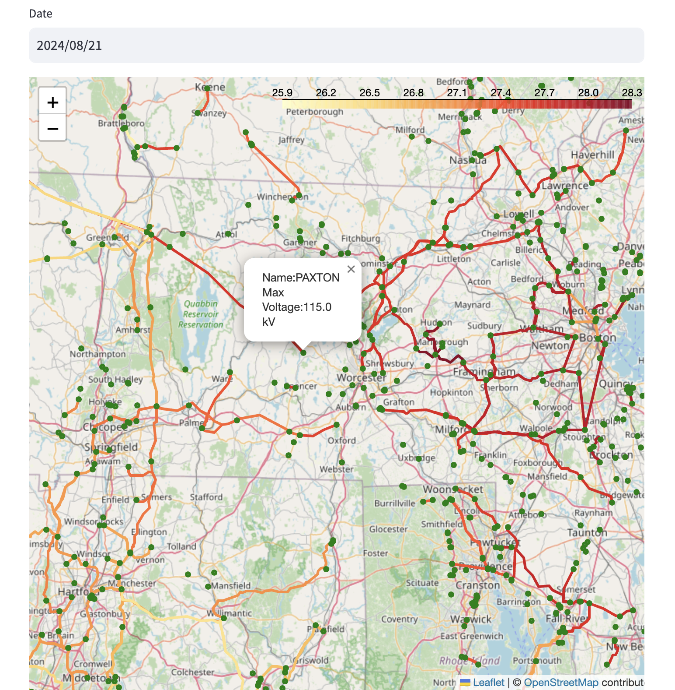

# Transmission Capacity

This project is a web app that is designed to help energy generation project managers plan for where is best to implement new generation projects.  The app provides several variables to investigate with including:
- existing transmission capacity
- congestion costs
- existing solar/wind generation

## Setup

### Large Files

Follow the [instructions here](https://git-lfs.com/) to ensure git LFS is installed to properly interact with data files via git.

### Dependencies
`pip install -r requirements.txt`

### Environment Variables

Create a file named `.env` in the project root and store values for the following variables in there:
- `NE_ISO_EMAIL`
- `NE_ISO_PASSWORD`

Request variable values from a project owner if needed.  For New England ISO credentials, visit [ISO Express](https://www.iso-ne.com/markets-operations/iso-express).

## Run the app

`python -m streamlit run app.py`

